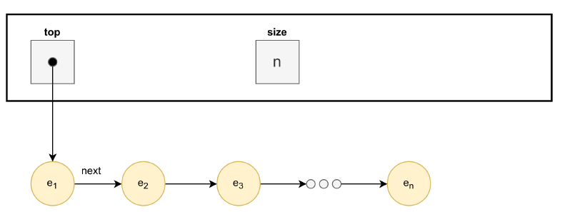

ADT Stack Template - 2026/27 [Parte 2]
===

Este repositório consiste num projeto **IntelliJ** 
de suporte à lecionação dos tipos abstratos de dados (ADTs) na linguagem Java,
no contexto da unidade curricular de *Tópicos Avançados de POO* - ESTSetúbal.

Os exercícios solicitados são os seguintes:

## ADT Stack | Exercícios de implementação

**1.** Faça *clone* deste projeto base **ADTStack_Parte2** (projeto **IntelliJ**) do *GitHub*:

**2.** Relativamente à classe `StackArrayList` forneça o código dos métodos por implementar, i.e., os que estão a lançar `UnsupportedOperationException`.

**3.** Compile e teste o programa fornecido, verificando que os resultados são os esperados; a excepção `FullStackException` deverá ser capturada com sucesso.

**4.** Elabore um conjunto de testes unitários para testar o ADT Stack (StackTest.java).

### Sugestão de testes unitários

Organize os testes por comportamento. Cada teste deve validar uma única propriedade e ter um nome que descreva claramente o resultado esperado.

| Categoria | Teste sugerido | Objetivo |
|---|---|---|
| Inicialização | `new_stack_is_empty` | Confirmar que uma nova pilha está vazia |
| Inicialização | `new_stack_has_size_zero` | Confirmar que o tamanho inicial é zero |
| `push` | `push_adds_element` | Verificar que o elemento é adicionado |
| `push` | `push_updates_size` | Confirmar a atualização do tamanho após a inserção |
| `peek` | `peek_returns_top` | Verificar que é devolvido o elemento no topo |
| `peek` | `peek_does_not_remove` | Confirmar que a consulta não altera a pilha |
| `pop` | `pop_returns_top` | Verificar a remoção e devolução do elemento no topo |
| `pop` | `pop_updates_size` | Confirmar a atualização do tamanho após a remoção |
| `clear` | `clear_empties_stack` | Confirmar que todos os elementos são removidos |
| LIFO | `stack_is_lifo` | Validar a propriedade *Last In, First Out* |
| Pilha vazia | `pop_empty_stack` | Verificar a exceção ao remover de uma pilha vazia |
| Pilha vazia | `peek_empty_stack` | Verificar a exceção ao consultar uma pilha vazia |
| Casos-limite | `push_duplicate_elements` | Confirmar que a pilha aceita valores repetidos |
| Casos-limite | `push_many_elements` | Verificar a capacidade ou o crescimento da implementação |
| Sequências | `mixed_operations` | Validar a interação entre várias operações consecutivas |

Use `assertThrows` nos testes em que é esperada uma exceção. Nos restantes, combine asserções sobre o elemento devolvido, o topo, o tamanho e o estado vazio da pilha, conforme o comportamento em análise.

**5.** Pretende-se uma diferente implementação baseada numa estrutura de dados de **Lista Simplesmente Ligada**, sem sentinelas (ver diagrama ilustrativo abaixo).


Partindo da estrutura de dados abaixo, complete a implementação da classe `StackLinkedList`.

```java
public class StackLinkedList<T> implements Stack<T> {
	private Node top; 
	private int size;

	public StackLinkedList() {
		this.top = null;
		this.size = 0;
	}

	private class Node { //inner class, só reconhecida neste contexto
		private T element;
		private Node next;
		public Node(T element, Node next) {
			this.element = element;
			this.next = next;
		}
	}
}
```

**6.** Substitua a implementação de `Stack` utilizada na classe de teste (`StackTest`) por uma instância de `StackLinkedList` e execute os testes novamente.


**7.** Indique e justifique as complexidades temporais de `push()` e `pop()` nas duas implementações.


## Critérios de conclusão da atividade

A atividade fica concluída quando:

- todos os métodos inicialmente assinalados como não implementados estão completos e deixaram de lançar `UnsupportedOperationException`;
- a implementação `StackArrayList`, baseada num array de capacidade fixa, respeita o contrato definido pela interface `Stack<T>`;
- existe uma classe `StackTest` com testes unitários para as operações `push`, `pop`, `peek`, `size`, `isEmpty` e `clear`;
- os testes incluem o comportamento normal da pilha e as situações de pilha vazia e pilha cheia;
- `FullStackException` e `EmptyStackException` são lançadas e verificadas nas condições previstas pelo contrato;
- `StackLinkedList<T>` está implementada com uma lista simplesmente ligada, sem sentinelas;
- o mesmo conjunto de testes pode ser executado com `StackArrayList` e `StackLinkedList`, produzindo resultados equivalentes;
- são identificadas e justificadas as complexidades temporais de `push()` e `pop()` nas duas implementações;
- o projeto compila e todos os testes unitários passam.


## Exercícios Complementares


1. Para efeitos meramente pedagógicos, remova o atributo `size` da classe `StackLinkedList` e adapte o código existente para o tornar funcional.
