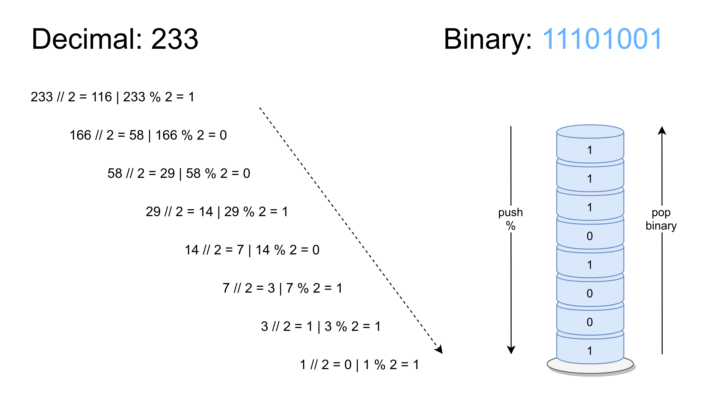

ADT Stack Template - 2026/27 [Parte 2]
===

Este repositório consiste num projeto **IntelliJ** 
de suporte à lecionação dos tipos abstratos de dados na linguagem Java,
no contexto da unidade curricular de *Tópicos Avançados de POO* - ESTSetúbal.

Os exercícios solicitados são os seguintes:

## ADT Stack | Exercícios de implementação

1. Faça *clone* deste projeto base **ADTStack_Template** (projeto **IntelliJ**) do *GitHub*:

2. Forneça o código dos métodos por implementar, i.e., os que estão a lançar `NotImplementedException`, n

3. Compile e teste o programa fornecido, verificando que os resultados são os esperados; a excepção `FullStackException` deverá ser capturada com sucesso.

4. Elabore um conjunto de testes unitários para testar o ADT Stack (StackTest.java).

5. Pretende-se uma diferente implementação baseada numa estrutura de dados de Lista Simplesmente Ligada, sem sentinelas.
Partindo da estruturas de dados abaixo, complete a implementação da classe StackLinkedList.

```java
public class StackLinkedList<T> implements Stack<T> {
	private Node top; 
	private int size;

	public StackLinkedList() {
		this.top = null;
		this.size = 0;
	}

	private class Node { //inner class, só reconhecida neste contexto
		private T element;
		private Node next;
		public Node(T element, Node next) {
			this.element = element;
			this.next = next;
		}
	}
}
```

6. Substitua a implementação de `Stack` utilizada na classe de teste (StackTest.java) por uma instância da classe StackLinkedList.Corra os testes.


7. Quais as complexidades algorítmicas para as operações `push()` e `pop()` nas duas implementações obtidas?

## Exercícios Complemenatres
1.  Para efeitos meramente pedagógicos, remova o atributo `size` da classe `StackLinkedList` e adapte o código existente para o tornar funcional. 


2. Exercícios de utilização

Um programa deverá solicitar um número ao utilizador, e.g., 233 e apresentar esse número em binário. O algoritmo divide sucessivamente o número por 2 (divisão inteira) até zero e guarda numa pilha o resto das divisões – ver figura. O número em binário é obtido removendo todos os elementos da pilha, i.e., pela ordem de saída. 




a. Crie uma classe `DecimalToBinary` contendo um método `main`; implemente o algoritmo solicitado no método:

    > `public static String decimal2Binary(int decimal)`

b. No método `main` crie o programa que solicita ao utilizador um número decimal e apresente a sua representação em binário; invoque o método anterior.
